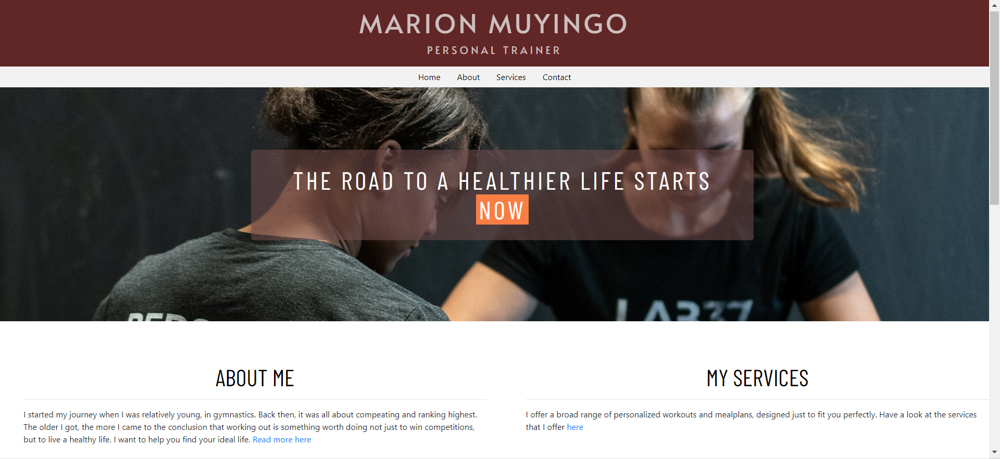
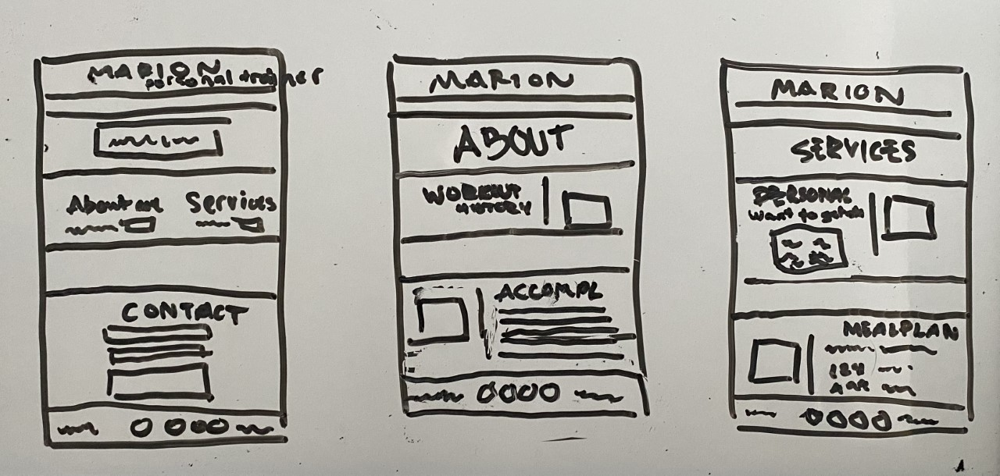

# **Marion Muyingo**
## **Personal Trainer**

[Link to the live project here.](https://matildamuyingo.github.io/milestoneproject1/)

This webpage is designed to help people in need of a personal trainer get in contact with Marion Muyingo, licensed Personal Trainer and Health Coach.

## **User Experience**
----
As a first time user of the website I want to:

- Be able to easily see what type of business this webpage represents, and how it can relate to me.
- Find ways to get in contact with the service provider and buy the product.
- See prices and be able to compare with other similar service providers.

## **User stories**
### **First Time Visitors**
1. As a First Time Visitor, I want to easily understand the main purpose of the site and learn more about what services can be provided.

2. As a First Time Visitor, I want to be able to easily navigate throughout the site to find content about pricing for the services.

3. As a First Time Visitor, I want to look for ways to get in contact with the person running the website, in the best way possible.

4. As a First Time Visitor, I want to find out more about the person the webpage is for and links to social media so I can see more content regarding daily activities.

### **Returning Visitor Goals**
1. As a Returning Visitor, I want to find information about the prices and how they may have changed since the last visit.

2. As a Returning Visitor, I want to find a faster way of getting in contact with the person running the website, preferably finding a phone number.

## **Design**
----
### **Colour Scheme**
The colors that the page mainly consists of are a burgundy red as the container color and white as the main background color. The sub-color is a lighter gray that appears as the navigation bar background color, as well as detailing and text color throughout the page.

### **Typography**
On the webpage you can find three different fonts used. The first is “Alata” and is used for the header text with the name of the page and the profession.

Next is the “Barlow Condensed” font that can be seen in most headings and subheadings throughout the page. This also contains a bit of letter spacing to make the font less compact.
### **Imagery**
The images that can be found in the background of the page are pictures taken in the gym that is run by “Marion Muyingo” and shows her helping previous customers. It gives the user a small overlook of the gym and the personal trainer that they might be hiring. 

## **Wireframes**
----

### **From left to right:**

- index.html
- about.html
- services.html

## **Features**
----
### **Index Page**
1. The name and profession at the top of the webpage are clickable and will function so that you get back to the index page when clicked.

2. Below the name, you can find a navigation bar to help navigate to the different pages on the site. The “about” and “services” are two separate pages, while the “contact” link brings you to the bottom of the index page, and a contact form.

3. There are two columns in a separate section with a shorter summary text of what can be found on the “about” and “services” pages. The heading for these columns are links to each respective page, and there is a clickable link at the end of each paragraph as well.

4. Further down you can find a form that can be used to get in contact. It consists of two required fields for the name and email of the sender and one text area for the message to be sent. 

5. At the bottom of the page is a footer that contains an email address and phone number, in case the user does not want to use the contact form. It also contains icons for social media links that can be useful to find further information.

### **About Page**
1. In the About page you can find a section dedicated to shining some light on the workout history. It’s divided into two subheadings, one explaining the background in crossfit and the other the gymnastics background.

2. Below the second Hero Image Divider there is a section about previous accomplishments, in the form of a list. When hovering over the list-items, the background changes color to easier read everything that is on the same row.

3. This page contains a footer at the bottom as well and is identical to the index page footer.

### **Services**
The structure on this page is the same as on the about.html page, but the content is different.

1. The Personal Training section contains some text to establish why the help of a personal trainer might be useful and the bottom row contains a highlighted offer for a free consultation. The bottom row of the paragraph is a link that leads to the contact form on the index page when clicked.

2. Below the text there is a square containing pricing information in Swedish crown (sek). This displays the price deals for buying different amounts of sessions, as well as a smaller, lighter gray text that clarifies that each session is 1 hour long.

3. Underneath the pricing information there is another button that leads to the contact form.

4. Further down is another section that is structured the same way as the Personal Training section, but without the pricing. It also has a button leading to the contact form.

5. Just like the other pages, there is an identical footer at the bottom of the page.
 
This webpage is responsive for two different screen sizes. It is adapted for mobile use with screens under 576px, and then there is the standard design for screens with a width that is wider than 576px.

## **Technologies Used**
----

### **Languages Used**
- [HTML5](https://en.wikipedia.org/wiki/HTML5)
- [CSS3](https://en.wikipedia.org/wiki/Cascading_Style_Sheets)

### **Frameworks, Libraries & Programs Used**
1. [Bootstrap 4.4.1:](https://getbootstrap.com/docs/4.4/getting-started/introduction/)
   - Bootstrap has been used throughout the webpage to help with adding different elements and the overall layout, as well as helping with the responsive design.
2. [Google Fonts:](https://fonts.google.com/)
   - The “Alata” and “Barlow Condensed” fonts were imported using google fonts.
3. [Font Awesome:](https://fontawesome.com/)
   - The icons that appear in the footer of the page were imported from the Font Awesome website.
4. [Git](https://git-scm.com/)
   - Git was used for version control by utilizing the Gitpod terminal to commit to Git and Push to GitHub.
5. [GitHub:](https://github.com/)
   - GitHub is used to store the projects code after being pushed from Git.

## **Testing**
----
The W3C Markup Validator and W3C CSS Validator Services were used to validate every page of the project.
- [W3C Markup Validator](https://jigsaw.w3.org/css-validator/#validate_by_input)
- [W3C CSS Validator](https://jigsaw.w3.org/css-validator/#validate_by_input)

### **Testing User Stories from User Experience (UX) Section**

#### **First Time Visitor Goals**

#### **Returning Visitor Goals**

## **Deployment**
---

### **GitHub Pages**
The project was deployed to GitHub Pages using the following steps...

1. Log in to GitHub and locate the [GitHub Repository](https://github.com/matildamuyingo/milestoneproject1)
2. At the top of the Repository (not top of page), locate the "Settings" Button on the menu.
3. Scroll down the Settings page until you locate the "GitHub Pages" Section.
4. Under "Source", click the dropdown called "None" and select "Master Branch".
5. The page will automatically refresh.
6. Scroll back down through the page to locate the now published [site link](https://matildamuyingo.github.io/milestoneproject1/) in the "GitHub Pages" section.

### **Forking the GitHub Repository**
By forking the GitHub Repository we make a copy of the original repository on our GitHub account to view and/or make changes without affecting the original repository by using the following steps...

1. Log in to GitHub and locate the [GitHub Repository](https://github.com/matildamuyingo/milestoneproject1)
2. At the top of the Repository (not top of page) just above the "Settings" Button on the menu, locate the "Fork" Button.
3. You should now have a copy of the original repository in your GitHub account.

### **Making a Local Clone**
1. Log in to GitHub and locate the [GitHub Repository](https://github.com/matildamuyingo/milestoneproject1)
2. Under the repository name, click "Clone or download".
3. To clone the repository using HTTPS, under "Clone with HTTPS", copy the link.
4. Open Git Bash
5. Change the current working directory to the location where you want the cloned directory to be made.
6. Type git clone, and then paste the URL you copied in Step 3.

## **Credits**
----

### **Code**
- [Bootstrap4:](https://getbootstrap.com/docs/4.4/getting-started/introduction/)    Bootstrap Library used throughout the project to make site responsive using the Bootstrap Grid System and other components that appear on the website.
- [This webpage](https://blog.hubspot.com/marketing/jump-link-same-page)    was used to understand how to link within an existing page
- [Stackoverflow:](https://stackoverflow.com/questions/21254889/bootstrap-how-to-remove-the-gutter-between-columns)   Used for help with removing bootstrap gutters
### **Content**
- All content was written by the developer.
### **Media**
- All Images were provided by Marion Muyingo, the service provider in the webpage.
### **Acknowledgements**
- My Mentor, Arnold Kyeza for continuous helpful feedback and design issues.
- Student Care at Code Institute for their support and help and providing me with a ReadMe template.

